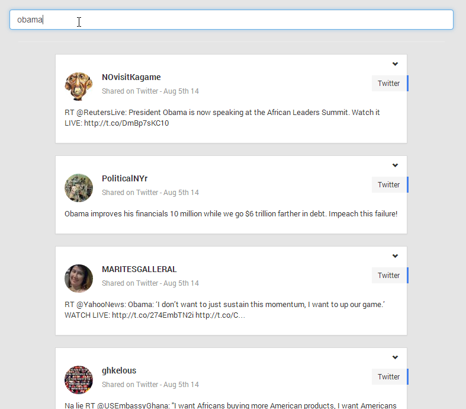

# Partify
Partify is an dashboard for looking at feeds from Instagram and Twitter in real-time. 
It is specially made for occasions like weddings, and annual celebrations where guests can tag their posts to share 
tweets or picture about the occasion :-)



*tags: Python, Flask, SocketIO, Redis, Bootstrap, Gulp*

# Installation

For this to work you will need:
* NodeJS
    * NPM for Node
* Python 2.X
    * easy_tools
* Redis server

## Dependencies installation

Install Bower globally:
```
$> npm install bower -g
```

Install all other dependencies (run from project root)
```
$> npm install
```

Install all bower components
```
$> bower install
```

Install all python modules
```
$> pip install -r requirements.txt
```

Build vendors (Bootstrap, jQuery, FontAwesome, IonIcons, MomentJS, MustacheJS)
```
$> gulp default
```

# Configuration 

The configuration file is located in the the main module "partify" and is named *config.py*.

# Running the application
You can run the project with the development server provided with Flask
```
$> python run.py
```